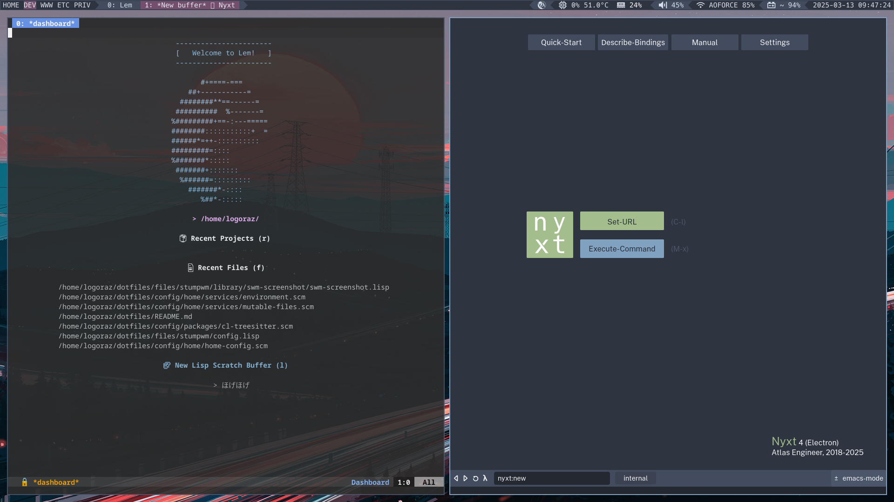
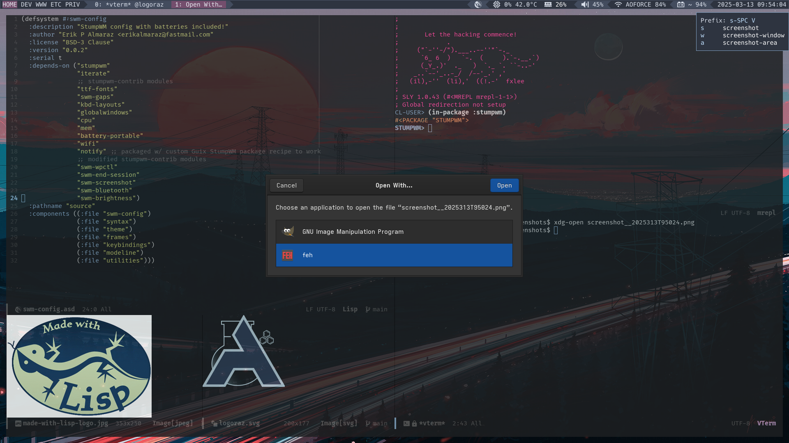

# GuixOS (System Home &key StumpWM) Configuration

GuixOS StumpWM [Cr]ystallized [Mo]mentum: A Custom Guix System Distribution configured
for StumpWM (Batteries Included). I'm riding out the last wave of X11 until
[StumpWM/Mahogany](https://github.com/stumpwm/mahogany)
is ready for use!

<p align="center">
  
</p>


GuixOS [Cr]ystallized [Mo]mentum has be successfully installed/trialed on the following:
 - Lenovo ThinkPad X1 Carbon 4th Gen (Type 20FB) Laptop (initial work)
 - Lenovo ThinkPad E15 4th Gen (newest faster laptop, future work)


## Screenshots






## Project Scaffolding

```lisp
    dotfiles/                                ;; Project Root
    |- config/
       |- home/                              ;; GuixOS Home Config Root
          |- home-config.scm                 ;; ** GuixOS StumpWM Home Config **
          |- dot-bash_profile.sh
          |- dot-bashrc.sh
          |- devtools-manifest.scm
          |- org-docs-manifest.scm
          |- services/                       ;; Home Service Modules
             |- environment.scm
             |- home-impure-symlinks.scm
             |- mutable-files.scm
             |- streaming.scm
             |- udiskie.scm
             |- xdg-files.scm
       |- packages/                          ;; Custom GuixOS Package Modules
          |- video.scm
          |- stumpwm.scm                     ;; to get master branch/dev version (temp)
          |- clasp.scm                       ;; WIP (trying n help folks finish this)
       |- services/                          ;; Custom GuixOS Service Modules
          |- tbd
       |- system/                            ;; GuixOS Config Root
          |- system-config.scm               ;; ** GuixOS StumpWM System Config **
          |- channels.scm
          |- core/                           ;; WIP (enhancement #2)
             |- base.scm
             |- heizenberg.scm
             |- locutus.scm
    |- files/                                ;; XDG_CONFIG_HOME Files (=> xdg-files.scm)
       |- assets/...
       |- common-lisp/...
       |- gnupg/...
       |- guile/...
       |- isync/...
       |- msmtp/...
       |- emacs/...
       |- lem/...
       |- nyxt/...
       |- stumpwm/                           ;; StumpWM Config [Cr]ystallized [Mo]mentum
          |- config.lisp
          |- swm-config.asd
          |- source/                         ;; modularized config 'scripts'
             |- swm-config.lisp
             |- syntax.lisp
             |- theme.lisp
             |- frames.lisp
             |- keybindings.lisp
             |- modeline.lisp
             |- utilities.lisp
          |- library/                        ;; Adapted contrib & personal modules
             |- swm-wpctl/          
             |- swm-end-session/
             |- swm-screenshot/
             |- swm-bluetooth/
             |- swm-brightness/
             |- wip-swm-nmctl/
       |- xorg/...
       |- zathura/...
       |- flatpak/...                        ;; WIP (enhancement #?)
```


## Philosophy

 - Create a highly functional WM setup that is efficient & aesthetic.
 - Construct a modulur Guix System configuration as a Guile program.
 - Configure everything using Common Lisp, Guile/Guix where possible!    
 - Packages installed at system level are considered core (vetted & there to take or leave)
 - Packages installed at home level are mutable
 - Handle customizations as custom Guix packages & services.
 - Generalize to support setup on multiple machines.
 - Optimize to create an efficient system for hacking in Common Lisp.
 - Eventually create a System/Home service utility that enhances Guix.   
 - Use Common Lisp & Guile programs where possible.

## Download & Install

First download and install Guix System from either of the release images below:

 - https://github.com/SystemCrafters/guix-installer
 - https://gitlab.com/nonguix/nonguix/-/releases

Once Guix has been installed from the release image, and the defined `channels`
file has be unlocked from a specific commit, do a `guix pull` to get to the
latest.

I personally use the SystemCrafters Guix release image as it comes
preconfigured with items that ease the pain of installation and the
instructions are excellent, see:
https://systemcrafters.net/craft-your-system-with-guix/full-system-install/

Next, download this project repo and edit the GuixOS configuration module
with your machine and user specific information, i.e. `swap-devices`,
`file-systems`, `user-account`, and `%user-name`. Note: See
"Establishing WiFi" section on a refresher for connecting to wifi via nmcli.

You probably won't have git installed, hence the `guix shell` command.

```bash

    $ guix shell git # Install git via guix shell...
    $ git clone https://github.com/logoraz/guixos-stumpwm.git ~/dotfiles
    $ cd ~/dotfiles
    
    # Edit GuixOS configuration module
    $ emacs ./config/system/system-config.scm

```

Also, you will need to edit the following Home modules with your specific
information:

  - `/.config/home/services/xdg-files.scm` => `%user-name`
  - `/.config/home/services/environment.scm` => `%user-name`
  - [`./config/home/home-config.scm` => `home-bash-configuration`] 
    - Optional if you choose a different root project directory name...

Note: I am currently working to generalize this to define machine and user
specific variables in one place...

Now we are ready to install GuixOS StumpWM ("Crystallized Momentum"), enter
the following command when logged into your initial WM (my case EXWM) using
eshell (doesn't work in a TTY perhaps need to pass sudo -E):

```bash

    $ sudo guix system -L ~/dotfiles/ \
      reconfigure ~/dotfiles/config/system/system-config.scm

    $ guix home -L ~/dotfiles/ \
      reconfigure ~/dotfiles/config/home/home-config.scm

```

Once the initial install is complete, you will be able to reconfigure using
the commands `gosr` & `gohr` if you choose to keep this project scaffolding, 
else you will need to edit `home-bash-configuration` in `home-config.scm`.


## Establishing Wifi

This can be done with the UI via `nm-connection-editor`, but I like to keep
reference to `nmcli`. Working on figuring out how to establish a 'clickable'
swaybar icon to automatically bring up `nm-connection-editor`. stay tuned...

```bash
  # List Wifi networks available
  $ sudo nmcli device wifi list

  # Connect to ESSID
  $ sudo nmcli device wifi connect <ESSID> password <network-password>
```

List known connections and delete them from list in Network Manager.

```bash
  # Get ESSID (name) or UUID of connection to delete
  $ sudo nmcli connection show

  # Delete connection via ID (aka name or ESSID)
  $ sudo nmcli connection delete <ESSID>
```


## Establishing Bluetooth

Bluetooth works and is automatically deployed via bluez in Guix system config,
however, initial device connection first needs to be established via
`blueman-manager`.

Still working on better integration, such as auto-starting `blueman-applet`
in sway config, however, it currently has a bug in it's dbus service that has
yet to be addressed, see https://issues.guix.gnu.org/71528. Note this handles
bluetooth connection interfacing with sway, i.e. detection and notifications.
You can start it up in a shell (and get a ugly warning message) once in
your sway session - I usually don't and things still work, but with out
notifications...

## Flatpak's

I am currently using flatpaks for web browser applications due to Guix's lack
of good available browsers (e.g. Zen or Nyxt-Electron)... Most of what can be
handled here by Guix is depolyed in `home-config.scm`, however, there are a few
aspects that are not handled such as app installation and data persistence.

Currently just noting down how I install flatpaks on Guix and what apps I use,
note to always use the `--user` flag where possible when using flatpak on Guix:

```bash
    # Initial setup of flatpak
    flatpak --user remote-add --if-not-exists flathub \
            https://dl.flathub.org/repo/flathub.flatpakrepo

    # Install Flatseal tool (first and foremost)
    flatpak --user install flathub com.github.tchx84.Flatseal

    # Install Nyxt-Electron (pre-release) browser (experimental browser)
    flatpak --user install <path/to/nyxt-electron-4.0.0-pre-release-3.flatpak>
    
    # Install Zen browser (reliable browser)
    flatpak --user install flathub app.zen_browser.zen
``` 

Note Flatpak's 'vanilla' installation on Guix is scaffold as follows:

```bash
    ~/.local/share/flatpak
    |- db/
```

### Work-arounds (currently implemented)
 - Need to symlink, via `mutable-files.scm`, `icons` for desired cursor/icons
   to two places `$HOME/.icons` and to `$XDG_DATA_HOME/icons`
 - Add `$XDG_DATA_HOME/flatpak/exports/share:`to `environment.scm`
   don't need to add `/var/lib/flatpak/exports/share` there for Guix (AFAIK)

### Wish List (TODO's)
 - Provide flatpaks visibility to system/home profile fonts
 - Configure Nyxt to communicate to external applications, i.e. KeePassXC or
   password-store
 - Remove necessity to use Flatseal...


## TODOs (Wish List)

 - Setup StumpWM config as it's own Common Lisp System [partially complete]
 - Configure StumpWM to handle multiple displays via xrandr
 - Configure `notify` & `globalwindows` contrib modules (update)
 - Complete/Create contrib modules for Bluetooth, Brightness and Network Management
 - Create base system config to apply to machine-specific configurations
 - Minimize/Reduce dependency on 'mutable-files` & `xdg-files`
 - Seemless integration with flatpak (with some reproducibility)
 - Implement/Use bcacefs for file systems

   
## References:

  - [StumpWM Configuration Inspiration](https://config.phundrak.com/stumpwm)
  - [How to Organize Your Guix Config](https://systemcrafters.net/craft-your-system-with-guix/how-to-organize-your-config/)
  - [Configuring Rational Emacs with Guix Home](https://systemcrafters.net/live-streams/july-8-2022/)
  - [Xorg Response Lag Solution](https://gitlab.com/nonguix/nonguix/-/issues/212)
  - TBD
  - TBD
